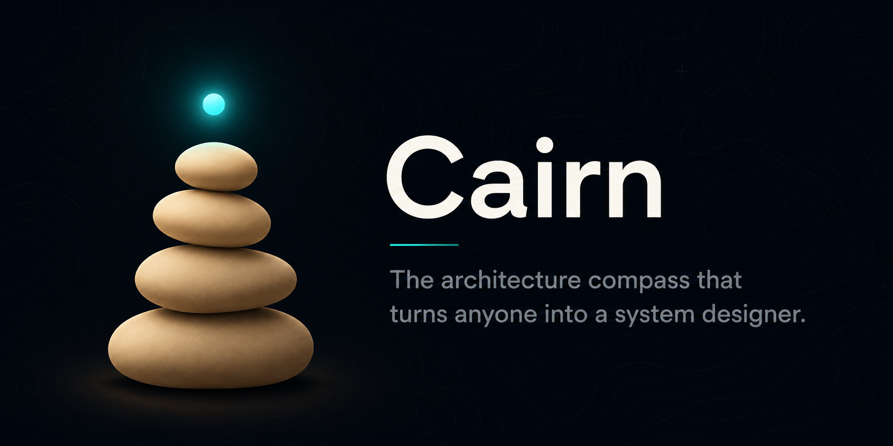

<div align="center">



# 🗿 Cairn

### The architecture compass that turns anyone into a system designer.

[](LICENSE)
[](https://github.com/mhd-nasher)
[](#)
[](#contributing)
[](https://github.com/mhd-nasher/cairn)

**Created by [Mohammed Nasher](https://github.com/mhd-nasher) · Open source (MIT) · Free for anyone to use**

</div>

---

Cairn is a self-contained system-design engine for AI coding assistants. It takes a **complete beginner**
and walks them to a correct, scalable, world-class system — and gives an **expert** an enforceable, citable
standard. It is *built structure* and *a guide at once*: like the stacked stones that mark the trail, it
both shows the way and is itself something you build.

> **Who built this?** Cairn is designed and authored by **Mohammed Nasher** ([@mhd-nasher](https://github.com/mhd-nasher)).
> It is released open source under MIT — use it, fork it, ship with it. If it helps you, a ⭐ on the repo
> and a mention go a long way.

## Why Cairn is different

Most architecture advice fails in one of two ways: it leaves beginners in **chaos** (no structure,
everything coupled), or it pushes them into **over-engineering** (layers and abstractions nobody needs).
Cairn refuses both:

1. **Beginner-proof guided mode** — an interview in plain language that designs the system *with* you, makes
   the hard calls for you with explanations, and tells you when to *stop* adding structure.
2. **Stack-aware** — it detects your real technology and *suppresses* the rules that don't fit (e.g. it
   won't tell you to "abstract the database" on a fixed Firebase app). No wasted indirection.
3. **The judgment layer** — the Anti-Over-Engineering Law: never add a boundary you can't justify with a
   concrete, real change.
4. **A full lifecycle** — design → plan → build → verify, with gates so nothing ships on assumptions.
5. **Verifiable** — Cairn ships with evals that prove it activates correctly and behaves correctly.

## Metadata

- **Version:** 1.0.0
- **Name:** `cairn`
- **Author:** Mohammed Nasher ([@mhd-nasher](https://github.com/mhd-nasher))
- **Tagline:** the architecture compass that turns anyone into a system designer
- **Modes:** Guided Build (beginner) · New Design · Audit/Refactor · Hand-off to Build
- **Stack-aware:** Firebase/serverless · mobile/Flutter · web · monolith · microservices · CLI/library · embedded · data/ML
- **Category:** Software architecture & system design
- **Risk:** Low (advisory — produces structure, designs, plans, and reviews; does not modify code by itself)
- **License:** MIT

## What's inside

```
cairn/
├── SKILL.md                          # Entry point: identity, Step 0, 3 modes, lifecycle, 10 rules, the law
├── README.md                         # This file
├── LICENSE                           # MIT
├── CHANGELOG.md                      # Version history
├── reference/
│   ├── rules.md                      # 57 enforceable rules with IDs
│   ├── rules-plain-language.md       # Every rule in human words + when NOT to apply
│   ├── stack-profiles.md             # Per-stack APPLY/SUPPRESS + default boundary level (anti-dogma)
│   ├── over-engineering-guardrails.md# The judgment layer — when NOT to add structure
│   ├── modern-essentials.md          # World-class production extras (secrets, idempotency, security…)
│   ├── process-discipline.md         # The design/plan/verify gates + skill-TDD
│   ├── principles.md                 # Every principle, with "applies when"
│   ├── patterns.md                   # Humble Object, Plugin, Gateway, …
│   ├── anti-patterns.md              # Big Ball of Mud, Zone of Pain, … with fixes
│   └── glossary.md                   # The vocabulary, defined
├── workflows/
│   ├── guided-build-for-beginners.md # Mode 0 — interview-driven beginner build (headline feature)
│   ├── apply-to-new-design.md        # Mode A — new systems
│   ├── audit-existing-code.md        # Mode B — audits / refactors
│   └── handoff-to-build.md           # Design → plan → build → verify bridge
├── checklists/
│   ├── design-review.md              # Pre-build architecture checklist
│   └── code-review.md                # Reviewing existing code
├── templates/
│   └── adr-template.md               # Architecture Decision Record
├── examples/
│   ├── compliant-example.md          # A sound order-processing system
│   └── violation-fixed.md            # A before/after refactor
├── evals/
│   ├── trigger-eval.json             # Activation tests (should / shouldn't trigger)
│   ├── evals.json                    # Behavior tests
│   └── README.md                     # Skill-TDD guide (RED-GREEN-REFACTOR)
└── scripts/
    └── check_dependencies.py         # Circular-dependency checker (enforces R-005 / ADP)
```

## Install

**Personal skill (recommended):**

```bash
# Claude Code
cp -R cairn ~/.claude/skills/
```

Then start a new session. Cairn auto-activates when you discuss designing, structuring, reviewing, or
refactoring a system.

**Project skill:**

```bash
mkdir -p .claude/skills && cp -R cairn .claude/skills/
```

## How to use it

**Beginner — "I don't know how to design this":**
> "I want to build an app where users book a cleaning and pay for it. It'll run on Firebase. I don't know how to structure it."

Cairn runs Step 0 (detects Firebase, sizes it as a small project), then Mode 0: an interview that produces a
concrete folder tree, a build order, and tells you exactly what to keep simple — in plain language.

**Expert — new design:**
> "Design the architecture for a multi-tenant SaaS backend on Postgres that a team will maintain for years."

Cairn detects the long-lived monolith profile, applies the full rule set, defers the swappable decisions,
and produces an ADR.

**Audit:**
> "Review this service for architectural problems."

Cairn maps the structure, flags real issues with rule IDs, and — critically — labels book-correct-but-
stack-wrong findings as suppressed instead of reporting noise.

## Verify it works

```bash
# Activation + behavior tests live in evals/. See evals/README.md for the skill-TDD workflow.
python3 -c "import json; json.load(open('cairn/evals/trigger-eval.json')); json.load(open('cairn/evals/evals.json')); print('evals OK')"
# Enforce the no-cycles rule (R-005) on any Python tree:
python3 cairn/scripts/check_dependencies.py <path>
```

## Scope & honesty

Cairn produces **structure, designs, plans, and reviews**. It does not, by itself, prove a system is secure
or bug-free — code touching money or user data gets a **separate bug + security review** before shipping.
Cairn is stack-aware: a rule that doesn't fit your stack is suppressed, with the reason stated.

## Contributing

Cairn is open source and contributions are welcome. Open an issue or a pull request on the
[GitHub repo](https://github.com/mhd-nasher/cairn). Ideas that fit Cairn's spirit: new stack profiles,
sharper over-engineering guardrails, more evals, additional worked examples. See `evals/README.md` for the
skill-TDD workflow used to keep Cairn trustworthy.

## Author & Credits

**Cairn is created and maintained by Mohammed Nasher.**

- 👤 **Author:** Mohammed Nasher
- 🐙 **GitHub:** [@mhd-nasher](https://github.com/mhd-nasher)
- 📦 **Repository:** [github.com/mhd-nasher/cairn](https://github.com/mhd-nasher/cairn)
- 🧩 **Forge suite siblings:** [Helm](https://github.com/mhd-nasher/helm) · [Loom](https://github.com/mhd-nasher/loom) · [Anvil](https://github.com/mhd-nasher/anvil) · [Lens](https://github.com/mhd-nasher/lens) · [Bastion](https://github.com/mhd-nasher/bastion) · [Relay](https://github.com/mhd-nasher/relay) — hub: [forge](https://github.com/mhd-nasher/forge)
- 💬 **Contact / questions / collaboration:** reach out via [GitHub](https://github.com/mhd-nasher) — open an issue or start a discussion on the repo.

If you use Cairn in a project, a credit back to [@mhd-nasher](https://github.com/mhd-nasher) is appreciated.
See [`CITATION.cff`](CITATION.cff) for citation details.

## License

[MIT](LICENSE) © Mohammed Nasher ([@mhd-nasher](https://github.com/mhd-nasher)). Free to use, modify, and
distribute — keep the copyright and license notice.

---

<div align="center">

**Built with intent by [Mohammed Nasher](https://github.com/mhd-nasher) 🗿**

*If Cairn helped you build something solid, drop a ⭐ — it helps others find it.*

</div>
