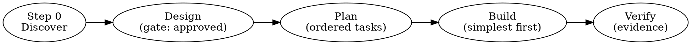

# Cairn

**The architecture compass that turns anyone into a system designer.**

A cairn is a stack of stones built by hand to mark the right path for travelers who would otherwise get
lost. This skill is the same idea in software: it is *built structure* and *a guide at once* — it shows a
beginner the correct way to build, and gives an expert a precise standard to enforce. Cairn is a complete,
self-contained system-design engine.

## Purpose

Make correct architecture the default outcome, for anyone, and carry it all the way to a verified build.
Cairn kills two opposite failure modes:
1. **Chaos** — no structure, everything coupled, impossible to change or test (the beginner's trap).
2. **Over-engineering** — boundaries and abstractions nobody needs, built for a future that never arrives.

It steers between them with a stack-aware, judgment-first method, and a disciplined lifecycle that refuses
to call work "done" without evidence.

## When to Use

- "How should I build / structure this?" (beginner or expert)
- Designing a new system, service, feature, or module
- Reviewing, auditing, or refactoring existing code
- Drawing boundaries; deciding dependencies; applying SOLID
- Deciding whether the database / web / framework is a detail
- Planning the build order; assessing testability and decoupling
- Any time someone is unsure how to organize code and wants it done *right*

## The Cairn Lifecycle (design → plan → build → verify)

Cairn is not just a design reference — it carries work through to a verified result, with a gate at each
hand-off so nothing ships on assumptions.



1. **Step 0 — Discover** the stack and the user's level. *(Always.)*
2. **Design** — produce the structure. **Design Gate:** do not emit a final structure until the use cases
   and constraints are understood and the design is approved. (See `reference/process-discipline.md`.)
3. **Plan** — turn the design into an ordered list of small, testable build tasks. (`workflows/handoff-to-build.md`)
4. **Build** — implement simplest-thing-first, honoring the complexity budget.
5. **Verify** — **Verification Gate:** never claim "done" without evidence (tests pass, dependency check
   clean, review run). Cairn produces *structure*, not a security guarantee — money/user-data code gets a
   separate bug + security review before shipping.

## How It Works — Always Start at Step 0

```
[██░░░░░░░░░░░░░░░░░░] Step 0  — Detect the stack & the user's level
[████░░░░░░░░░░░░░░░░] Route   — Pick the mode below
[████████████████████] Execute — Run the chosen workflow with stack-aware rules
```

### Step 0: Discovery (MANDATORY, never skip)

1. **Detect the stack.** Inspect the repo (package.json, pubspec.yaml, firebase.json, requirements.txt,
   go.mod, etc.) or ask. Map it to a profile in `reference/stack-profiles.md`.
2. **Load the stack profile.** It tells you which rules **APPLY**, which to **SUPPRESS**, and the sensible
   default boundary level for that stack. *This is what prevents over-engineering.*
3. **Gauge the user's level.** Beginner ("I don't know how to design this") → Mode 0. Otherwise Mode A/B.
4. **Set the complexity budget.** Small/solo/MVP → minimal boundaries. Large/team/long-lived → full.

> **Why this matters:** "the web is an IO device", "the database is a detail", "defer the framework" are
> *correct in general* but near-worthless on a Firebase/Flutter app where the framework IS the deployment
> model. The stack profile suppresses these so you never add useless indirection. See
> `reference/over-engineering-guardrails.md`.

## The Three Modes

| Mode | For | Workflow |
|------|-----|----------|
| **Mode 0 — Guided Build (Beginner)** | "I don't know how to design this." | `workflows/guided-build-for-beginners.md` |
| **Mode A — New Design (Experienced)** | Designing a new system/boundary. | `workflows/apply-to-new-design.md` |
| **Mode B — Audit / Refactor** | Reviewing or fixing existing code. | `workflows/audit-existing-code.md` |

After any mode, hand off to `workflows/handoff-to-build.md` to plan and verify the build.

**Mode 0 is the headline feature.** An interview in plain language: it makes the structural decisions *for*
the user with explanations, draws the boundaries, names the files, and says when to *stop* adding structure.
No prior architecture knowledge required.

## The 10 Non-Negotiable Rules (with plain-language meaning)

Start every design and review here. Full set of 57 rules + plain-language layer in `reference/rules.md`
and `reference/rules-plain-language.md`.

1. **R-001 — Dependency Rule (inward only).** *Plain:* the important business logic must not know about the database, UI, or framework — only the reverse.
2. **R-011 — No SQL/DB in use cases or entities.** *Plain:* keep all database code at the edge; business rules never see a query.
3. **R-012 — No frameworks in core code.** *Plain:* your business logic must run without React/Spring/Firebase loaded.
4. **R-030 — The web is an IO device.** *Plain:* HTTP is just delivery; logic shouldn't care it was a web request. *(SUPPRESS for thin serverless handlers — see stack profile.)*
5. **R-031 — The database is a detail.** *Plain:* design the logic first; the DB is a plug-in. *(SUPPRESS when the DB is a fixed managed service you'll never swap.)*
6. **R-016 — SRP: one actor per module.** *Plain:* a file/class should have one reason to change; split code that serves different stakeholders.
7. **R-005 — ADP: no cycles in dependencies.** *Plain:* A→B→A is forbidden; the dependency graph must be acyclic.
8. **R-024 — SDP: depend toward stability.** *Plain:* volatile code depends on stable code, never the reverse.
9. **R-025 — SAP: abstractness tracks stability.** *Plain:* the more code depends on it, the more it should be an interface, not a concrete class.
10. **R-026 — Maximize decisions not made.** *Plain:* defer hard-to-reverse choices (DB, framework) until you must; keep options open.

## The Anti-Over-Engineering Law (read before applying any rule)

> **A boundary, interface, or abstraction must earn its place. If you cannot name the concrete change it
> protects against, do NOT add it.** Start with the simplest structure the stack profile allows. Add a
> boundary only when (a) two real implementations exist or are imminent, (b) a real team/release split
> demands it, or (c) testability genuinely requires it. "We might need it later" is not a reason.

Full guidance: `reference/over-engineering-guardrails.md`.

## Process Discipline (gates that keep Cairn honest)

Cairn embeds a lightweight working discipline so designs become verified reality, not good intentions:

- **Design Gate** — understand requirements and get the design approved *before* emitting final structure.
- **Plan before build** — convert the design to ordered, testable tasks.
- **Verify before done** — evidence (passing tests, clean dependency check, a review) before any "done" claim.

Details and the decision flow: `reference/process-discipline.md`.

## World-Class Extras

`reference/modern-essentials.md` carries the production concerns pure structure ignores — each with an
"applies when" so beginners don't over-apply: config & secrets (12-factor), idempotency,
observability/logging, error handling, security basics, data integrity & transactions, API/contract
design, async & events, DDD-lite. These compose *with* the Dependency Rule; they never replace it.

## Reference Files (load on demand)

- `reference/rules.md` — all 57 enforceable rules with IDs and rationale.
- `reference/rules-plain-language.md` — every key rule in human words + **when NOT to apply it**.
- `reference/stack-profiles.md` — per-stack APPLY/SUPPRESS table + default boundary level. **Load in Step 0.**
- `reference/over-engineering-guardrails.md` — the judgment layer: when to stop adding structure.
- `reference/modern-essentials.md` — the world-class production extras.
- `reference/process-discipline.md` — the design/plan/verify gates and the build discipline.
- `reference/principles.md` — every principle, with rationale and "applies when".
- `reference/patterns.md` — Humble Object, Plugin, Gateway, etc.
- `reference/anti-patterns.md` — Big Ball of Mud, Framework-Centric, Zone of Pain, etc., with fixes.
- `reference/glossary.md` — the vocabulary, defined.

## Workflows, Checklists, Templates, Examples, Scripts, Evals

- `workflows/guided-build-for-beginners.md` · `apply-to-new-design.md` · `audit-existing-code.md` · `handoff-to-build.md`
- `checklists/design-review.md`, `checklists/code-review.md` — tickable, tied to rule IDs.
- `templates/adr-template.md` — Architecture Decision Record.
- `examples/compliant-example.md`, `examples/violation-fixed.md` — worked examples.
- `scripts/check_dependencies.py` — circular-dependency checker (enforces ADP / R-005).
- `evals/trigger-eval.json`, `evals/evals.json`, `evals/README.md` — activation + behavior tests. Cairn's
  behavior is verifiable; run these after any change.

## Progress Gauge Convention

In Mode 0 and any multi-step run, show a gauge each step so the user never feels lost:

```
[████████░░░░░░░░░░░░] 40% — Step 2/5: Separating logic from details
```

## Cairn's Creed

- "Architecture exists to minimize the human effort to build and maintain the system."
- "The only way to go fast is to go well." · "Making messes is always slower than staying clean."
- "The database is a detail. The web is a detail. Frameworks are details — until your stack says otherwise."
- "Don't marry the framework." · "Build the simplest thing your stack allows; add a boundary only when a
  real change demands one. You can always add structure later — removing the wrong structure is the
  expensive mistake."

## Scope & Honesty

- Cairn is stack-aware by design: a rule that does not fit the detected stack is suppressed, with the reason stated.
- Cairn produces **structure, designs, plans, and reviews** — it does not, by itself, prove a system is
  secure or bug-free. Code touching money or user data gets a separate bug + security review before shipping.
- Cairn is technology-agnostic in principle; examples use concrete stacks for illustration only.

---

*Cairn — created by Mohammed Nasher ([@mhd-nasher](https://github.com/mhd-nasher)). Open source under MIT.*
