# Process Discipline — The Gates That Keep Cairn Honest

> A correct design that is never built, or built on unchecked assumptions, is worthless. Cairn embeds a
> lightweight working discipline so a design becomes a *verified* reality. Three gates, applied in every
> mode. Heavy process is itself a form of over-engineering — these gates are deliberately minimal and scale
> down to nothing for a trivial change. The point is evidence, not ceremony.

## The three gates

```dot
digraph gates {
  rankdir=LR;
  "Requirements" -> "DESIGN GATE" [label="understood?"];
  "DESIGN GATE" -> "Plan" [label="design approved"];
  "Plan" -> "Build" [label="ordered, testable tasks"];
  "Build" -> "VERIFY GATE" [label="implemented"];
  "VERIFY GATE" -> "Done" [label="evidence shown"];
  "VERIFY GATE" -> "Build" [label="evidence missing → fix"];
}
```

### Gate 1 — The Design Gate (before emitting final structure)

**Rule:** Do not produce a final folder structure, boundary set, or "here's how to build it" until you have
(a) understood the use cases and constraints, and (b) had the design confirmed.

- Ask clarifying questions **one at a time** — purpose, constraints, scale, success criteria.
- Propose the approach and its trade-offs; for a beginner, decide and explain (Mode 0 does this).
- Get a "yes, that's right" before turning the design into files and tasks.
- **Scale it:** for a truly small change the design is a sentence or two — but still state it and confirm.
- **Anti-pattern — "this is too simple to need a design":** the smallest changes are where unexamined
  assumptions waste the most work. State the design briefly; don't skip the gate.

**Why:** the most expensive bugs are requirement misunderstandings discovered after the build.

### Gate 2 — Plan Before Build

**Rule:** Convert the approved design into an ordered list of small, independently verifiable tasks before
writing implementation code. See `workflows/handoff-to-build.md`.

- Each task is small enough to verify on its own.
- Order: pure logic + its tests first → adapters → wiring → edges.
- Note the dependency direction each task must preserve (R-001).

**Why:** a plan turns architecture into action and makes progress (and gaps) visible.

### Gate 3 — Verify Before Done

**Rule:** Never claim work is "done", "fixed", "passing", or "complete" without showing evidence. Assertions
without evidence are not allowed.

Evidence, scaled to the change:
- Tests run and the **actual output** is shown (not "tests should pass").
- `scripts/check_dependencies.py` (or equivalent) is clean — no cycles (R-005).
- The design-review / code-review checklist has been run for the touched area.
- For money/user-data code: a **separate bug + security review** has been run. Cairn produces structure,
  not a security guarantee — say so plainly rather than implying safety.

**Why:** "done" without evidence is how broken work ships. Evidence before assertions, always.

## Skill-TDD — how Cairn proves *itself*

Cairn's own quality follows a test-first loop, mirrored in `evals/`:
1. **RED** — run a scenario WITHOUT the relevant guidance and watch the failure (e.g. an assistant
   over-engineers a Firebase app, or ships "done" with no evidence).
2. **GREEN** — add/adjust the guidance; re-run; confirm the behavior changes.
3. **REFACTOR** — find the new rationalization the guidance didn't cover, close it, re-verify.

`evals/trigger-eval.json` checks Cairn activates on the right prompts and stays quiet on the wrong ones.
`evals/evals.json` checks behavior (stack-aware suppression, beginner guidance, over-engineering defense,
full-rigor on a real monolith). If you change Cairn, you re-run these — the skill is only as trustworthy as
its last passing eval.

## When to dial the discipline down

- **Trivial, reversible change** (rename, comment, one pure function): design = one sentence; verify = the
  one test. Don't stage a ceremony.
- **One-way-door change** (data model, public API, service split, anything touching money): all three gates,
  full evidence. This is exactly where the rigor pays for itself.

The discipline is a dial, not a switch. Match it to the reversibility and stakes of the change.
